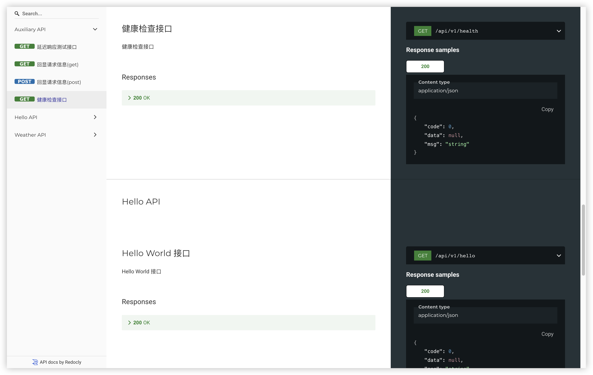

[English](./README.md) | 简体中文

# gin-auto-redoc

为已集成 Swagger (OpenAPI) 文档的 Gin 应用程序自动注册 Redoc API接口文档的 Go 包


[](https://pkg.go.dev/github.com/hargeek/gin-auto-redoc)
[](https://github.com/hargeek/gin-auto-redoc/graphs/contributors)
[](./LICENSE)

## 安装

```bash
go get github.com/hargeek/gin-auto-redoc
```

## 使用

在主文件中导入该包

在 Gin 应用程序中注册 Redoc 路由

```go
import (
    ginautodoc "github.com/hargeek/gin-auto-redoc"
    "github.com/gin-gonic/gin"
)

func main() {
    r := gin.New()
    ginautodoc.Register(r)
    r.Run()
}
```

## 配置

### 自定义swagger 路由

默认情况下，Swagger 文档位于 /api/v1/swagger，Redoc 文档位于 /api/v1/doc。要自定义这些路径，请在注册中间件之前使用所需的配置调用 SetConfig

```go
ginautodoc.SetConfig(ginautodoc.Config{
    SwaggerPath: "/custom/swagger",
})
ginautodoc.Register(r)
```

### 反向代理

如果文档由 nginx 反向代理且配置了路径重写，则需要向服务传递反向代理的路径前缀 X-Forwarded-Prefix 头，否则将无法访问，例如

- nginx 配置示例：

```nginx
location /custom_prefix/ {```
    proxy_pass http://localhost:8080;
    proxy_set_header X-Forwarded-Prefix "/custom_prefix";
}
```

- kubernetes ingress 配置示例：

```yaml
apiVersion: networking.k8s.io/v1
kind: Ingress
metadata:
  name: my-ingress
  annotations:
    nginx.ingress.kubernetes.io/rewrite-target: /$1
    nginx.ingress.kubernetes.io/use-regex: "true"
    nginx.ingress.kubernetes.io/configuration-snippet: |
      proxy_set_header X-Forwarded-Proto $http_x_forwarded_proto;
      proxy_set_header X-Forwarded-Prefix "/custom_prefix";
spec:
  ingressClassName: nginx
  rules:
  - host: example.com
    http:
      paths:
      - backend:
          service:
            name: api-service
            port:
              number: 8080
        path: /custom_prefix/(.*)$
        pathType: Prefix
```

## 访问 Redoc

启动 Gin 应用程序后，在 `http://localhost:<port>/api/v1/doc/index.html` 访问 Redoc 文档


